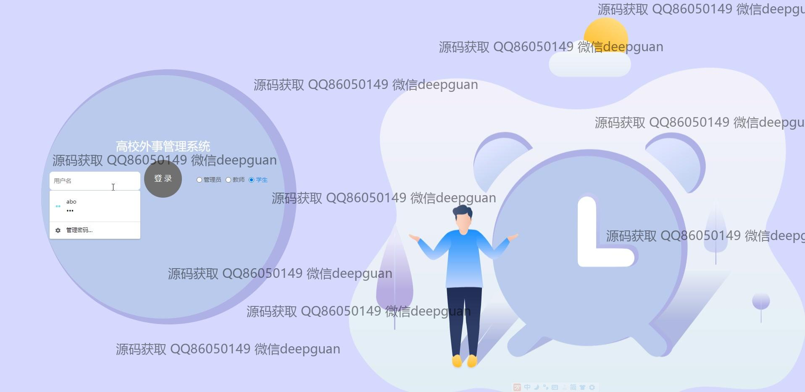
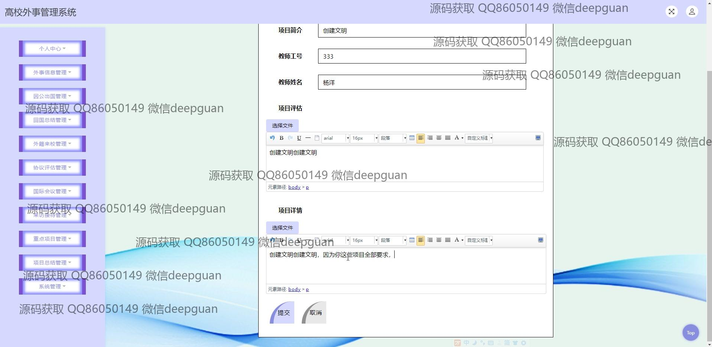
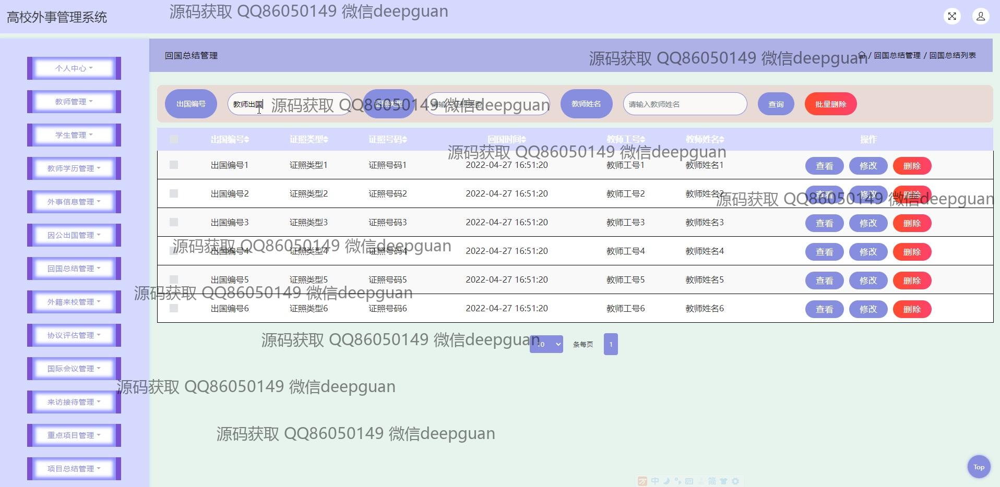
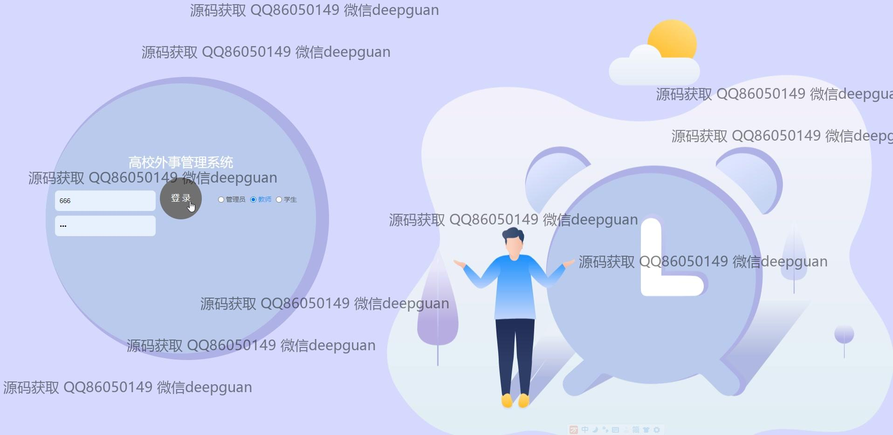

<h1 align="center">高校外事管理系统的设计与开发+jsp</h1>

## 简介
高校外事管理系统：角色分为管理员、教师、学生；功能包括教师管理、学生管理、外事信息管理、因公出国管理及外籍来校管理等，支持信息录入、审核、修改、删除和搜索等操作。    --计算机毕业设计源码；毕设源码；java毕业设计源码

## 联系方式

<h3 align="center">获取完整代码与数据库文件 + 微信：deepguan QQ: 86050149 QQ群: 783742310</h3>

<h3 align="center">可帮忙远程部署 包运行成功！提供远程部署、修改代码、设计文档指导、代码讲解等服务！</h3>

## 功能介绍（完整见运行截图）
管理员： 提供用户身份验证，包括登录与角色选择功能；管理教师、学生及外事相关信息，支持创建、查看、修改及删除各类记录；可管理因公出国及外籍人员来访信息，处理协议及会议事宜，通过文件上传和丰富的文本编辑器完善数据；查看审核状态及回复，通过导航栏快速切换至个人中心或其他管理模块。

教师： 登陆后可查看和管理个人信息，参与外事活动；提交申请出国及外事接待，包括填写详细清求及上传相关文件或图片；使用文本编辑器进行内容格式化；审核学生或外籍人员的申请及合同协议；通过导航栏高效切换个人中心、信息管理等功能界面。

学生： 登录后能访问个人中心，进行个人信息管理；提交出国申请，填写个人及学术信息，并上传相关学习文件；能查看审核状态和系统通知信息，通过导航栏浏览学生管理、学分核定和系统管理模块，实现全面的信息处理。

外籍人员： 主要参与外籍来访管理，管理员可以录入其基本信息，包括协议信息及到期时间；支持搜索筛选外籍人员的记录和查看评估状态；提供便捷的协议内容上传与编辑功能，实现对外籍专家信息的梳理与管理。

## 运行截图

本代码来源于网络,仅供学习参考使用!

